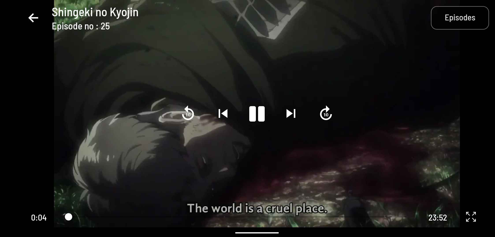

[![Contributors][contributors-shield]](https://github.com/silenttush/animy/network)
[![Forks][forks-shield]](https://github.com/silenttush/animy/network/members)
[![Stargazers][stars-shield]](https://github.com/silenttush/animy/stargazers)
[![Issues][issues-shield]](https://github.com/silenttush/animy/issues)
[![MIT License][license-shield]](https://github.com/silenttush/animy/blob/main/license)
[![LinkedIn][linkedin-shield]](https://www.linkedin.com/in/tushar-kushwaha-b2b82918a/)

<!-- PROJECT LOGO -->
<br />
<p align="center">
  <a href="https://github.com/othneildrew/Best-README-Template">
    
  </a>

  <h3 align="center">Animy : Ad-Free Anime</h3>

  <p align="center">
    Animy is a react native app made for anime lovers, who love to watch anime without ads.
    <br />
    <a href="https://github.com/SilentTush/Animy"><strong>Explore the docs »</strong></a>
    <br />
    <br />
    <a href="https://github.com/SilentTush/Animy/releases">Download app</a>
    ·
    <a href="https://github.com/SilentTush/Animy/issues">Report Bug</a>
    ·
    <a href="https://github.com/SilentTush/Animy/issues">Request Feature</a>
  </p>
</p>

<!-- TABLE OF CONTENTS -->
<details open="open">
  <summary>Table of Contents</summary>
  <ol>
    <li>
      <a href="#about-the-project">About The Project</a>
      <ul>
        <li><a href="#built-with">Built With</a></li>
      </ul>
    </li>
    <li>
      <a href="#getting-started">Getting Started</a>
      <ul>
        <li><a href="#prerequisites">Prerequisites</a></li>
        <li><a href="#installation">Installation</a></li>
      </ul>
    </li>
    <li><a href="#screenshots">Screenshots</a></li>
    <li><a href="#roadmap">Roadmap</a></li>
    <li><a href="#contributing">Contributing</a></li>
    <li><a href="#license">License</a></li>
    <li><a href="#contact">Contact</a></li>
    <li><a href="#acknowledgements">Acknowledgements</a></li>
  </ol>
</details>

<!-- ABOUT THE PROJECT -->

## About The Project


&nbsp

&nbsp

&nbsp


There are many anime sites where you can watch anime for free but with a lot of ads, animy just scraps links from many such online websites. So, we do not host any pirated content ourselves, we just use links that are already available on the internet.

Animy is created to provide anime for free.

### Built With

This section should list any major frameworks that you built your project using. Leave any add-ons/plugins for the acknowledgements section. Here are a few examples.

- [React Native](https://reactnative.dev/)
- [Moti](https://moti.fyi/)
- [Expo](https://expo.io/)

<!-- GETTING STARTED -->

## Getting Started

Please follow the steps carefully to make this project work in your system.

### Prerequisites

This is an example of how to list things you need to use the software and how to install them.

Install Node

- [Node](https://nodejs.org/en/download/)

- install expo-cli
  ```sh
  npm install --global expo-cli
  ```

### Installation

1. Clone the repo
   ```sh
   git clone https://github.com/SilentTush/Animy.git
   ```
2. Install NPM packages
   ```sh
   npm install
   ```
3. Start Project

   ```sh
   expo start
   ```

## Screenshots





<!-- ROADMAP -->

## Roadmap

See the [open issues](https://github.com/SilentTush/Animy/issues) for a list of proposed features (and known issues).

<!-- CONTRIBUTING -->

## Contributing

Contributions are what make the open source community such an amazing place to be learn, inspire, and create. Any contributions you make are **greatly appreciated**.

1. Fork the Project
2. Create your Feature Branch (`git checkout -b feature/AmazingFeature`)
3. Commit your Changes (`git commit -m 'Add some AmazingFeature'`)
4. Push to the Branch (`git push origin feature/AmazingFeature`)
5. Open a Pull Request

<!-- LICENSE -->

## License

Distributed under the MIT License. See `LICENSE` for more information.

<!-- CONTACT -->

## Contact

Tushar Kushwaha - [Telegram](https://web.telegram.org) - @Beyondplusultra

Project Link: [https://github.com/SilentTush/Animy](https://github.com/SilentTush/Animy)

<!-- MARKDOWN LINKS & IMAGES -->
<!-- https://www.markdownguide.org/basic-syntax/#reference-style-links -->

[contributors-shield]: https://img.shields.io/github/contributors/othneildrew/Best-README-Template.svg?style=for-the-badge
[forks-shield]: https://img.shields.io/github/forks/othneildrew/Best-README-Template.svg?style=for-the-badge
[stars-shield]: https://img.shields.io/github/stars/othneildrew/Best-README-Template.svg?style=for-the-badge
[issues-shield]: https://img.shields.io/github/issues/othneildrew/Best-README-Template.svg?style=for-the-badge
[license-shield]: https://img.shields.io/github/license/othneildrew/Best-README-Template.svg?style=for-the-badge
[linkedin-shield]: https://img.shields.io/badge/-LinkedIn-black.svg?style=for-the-badge&logo=linkedin&colorB=555
